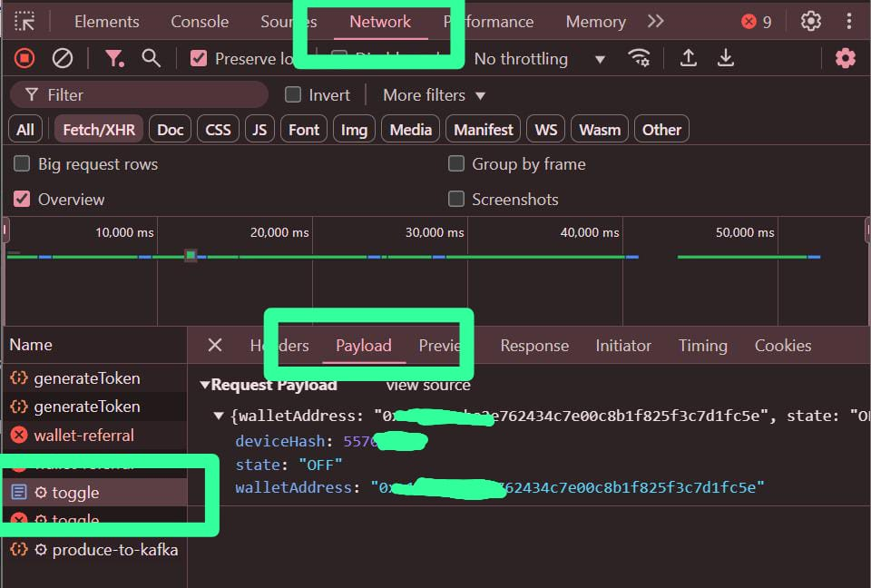

# Naoris Node Protocol BOT
Naoris Node Protocol BOT

- Register Here : [Naoris Protocol Testnet](https://naorisprotocol.network/testnet)
- Dwonload Wallet: [Naoris Protocol Wallet](https://chromewebstore.google.com/detail/naoris-protocol-wallet/dbgibbbeebmbmmhmebogidfbfehejgfo)
- Dwonload Extension: [Naoris Protocol Browser Security Node](https://chromewebstore.google.com/detail/naoris-protocol-browser-s/cpikalnagknmlfhnilhfelifgbollmmp)
- Use Code: LXk3YV4LIfe4XQEQ

## Features

  - Auto Get Account Information
  - Auto Run With [Monosans](https://raw.githubusercontent.com/monosans/proxy-list/main/proxies/all.txt) Proxy - Choose 1
  - Auto Run With Private Proxy - Choose 2
  - Auto Run Without Proxy - Choose 3
  - Auto Add to Whitelist
  - Auto Send Ping Every 25 Seconds
  - Multi Accounts With Threads

- Note: Points Not Increase? pending bruh. please be patient.

## Requiremnets

- Make sure you have Python3.9 or higher installed and pip.

## Instalation

1. **Clone The Repositories:**
   ```bash
   git clone https://github.com/christiangrey922/Naorish-running-bot.git
   ```
   ```bash
   cd Naorish-running-bot
   ```

2. **Install Requirements:**
   ```bash
   pip install -r requirements.txt #or pip3 install -r requirements.txt
   ```

## Configuration

### Screenshots

<div style="text-align: center;">
  <h4><strong>Device Hash</strong></h4>
  
</div>

- **accounts.json:** You will find the file `accounts.json` inside the project directory. Make sure `accounts.json` contains data that matches the format expected by the script. Here are examples of file formats:
  ```bash
  [
      {
          "Address": "Your evm address 1",
          "deviceHash": "Your device hash 1"
      },
      {
          "Address": "Your evm address 2",
          "deviceHash": "Your device hash 2"
      }
  ]
  ```

- **proxy.txt:** You will find the file `proxy.txt` inside the project directory. Make sure `proxy.txt` contains data that matches the format expected by the script. Here are examples of file formats:
  ```bash
    ip:port # Default Protcol HTTP.
    protocol://ip:port
    protocol://user:pass@ip:port
  ```
  You can buy proxy at [here](https://app.proxies.fo/ref/2fe2c521-8a31-47f2-5f90-776f2627dd01). Use ISP proxy with unlimited thread, you can run a milion account as much as u can.
  


## Run

```bash
python bot.py 
```

## Stay Connected

- Telegram : [Telegram](https://t.me/xamdepin)

## Donation

If you would like to support the development of this project, you can make a donation using the following addresses:

- Solana: `Gz7QxSUXXYH6pZQQPGxj7nU3AFUxZgMCB112AVVzaZSE`
- BNB: `0xf61dbe74a5e0e197e1c92c316ed1dd1c88db6bc6`

## Disclaimer

This tool is for educational purposes only. Use it at your own risk.
